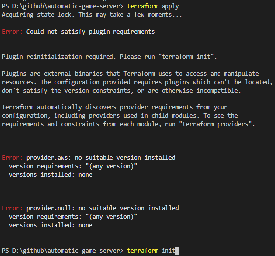
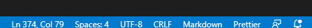
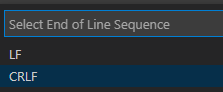

# Pre-requirement on AWS side - Create SSH key

In this documentation you can find information about common issues.

# Table of contents

- [Pre-requirement on AWS side - Create SSH key](#pre-requirement-on-aws-side---create-ssh-key)
- [Table of contents](#table-of-contents)
  - [Could not satisfy plugin requirements](#could-not-satisfy-plugin-requirements)
    - [Fix](#fix)
  - [Unable to execute XY.sh: No such file or directory](#unable-to-execute-xysh-no-such-file-or-directory)
    - [Fix](#fix-1)
  - [License](#license)
  - [Author Information](#author-information)

## Could not satisfy plugin requirements

You will see this error message if you left to initialize terraform.


### Fix

Simply run `terraform init` command.

## Unable to execute XY.sh: No such file or directory

Typical error message:
```
PS D:\github\automatic-game-server> terraform apply
data.aws_ami.Amazon_Linux: Refreshing state...

An execution plan has been generated and is shown below.
Resource actions are indicated with the following symbols:
  + create

Terraform will perform the following actions:

  # aws_instance.csgo_ansible_instance will be created
  + resource "aws_instance" "csgo_ansible_instance" {
      + ami                          = "ami-04d29b6f966df1537"
      + arn                          = (known after apply)
      + associate_public_ip_address  = (known after apply)
      + availability_zone            = (known after apply)
      + cpu_core_count               = (known after apply)
      + cpu_threads_per_core         = (known after apply)
      + get_password_data            = false
      + host_id                      = (known after apply)
      + id                           = (known after apply)
      + instance_state               = (known after apply)
      + instance_type                = "t3a.medium"
      + ipv6_address_count           = (known after apply)
      + ipv6_addresses               = (known after apply)
      + key_name                     = "csgo"
      + outpost_arn                  = (known after apply)
      + password_data                = (known after apply)
      + placement_group              = (known after apply)
      + primary_network_interface_id = (known after apply)
      + private_dns                  = (known after apply)
      + private_ip                   = (known after apply)
      + public_dns                   = (known after apply)
      + public_ip                    = (known after apply)
      + secondary_private_ips        = (known after apply)
      + security_groups              = (known after apply)
      + source_dest_check            = true
      + subnet_id                    = (known after apply)
      + tags                         = {
          + "Automation"    = "true"
          + "Name"          = "counter_strike_go_server"
          + "cost_category" = "csgo"
        }
      + tenancy                      = (known after apply)
      + volume_tags                  = (known after apply)
      + vpc_security_group_ids       = (known after apply)

      + ebs_block_device {
          + delete_on_termination = (known after apply)
          + device_name           = (known after apply)
          + encrypted             = (known after apply)
          + iops                  = (known after apply)
          + kms_key_id            = (known after apply)
          + snapshot_id           = (known after apply)
          + volume_id             = (known after apply)
          + volume_size           = (known after apply)
          + volume_type           = (known after apply)
        }

      + ephemeral_block_device {
          + device_name  = (known after apply)
          + no_device    = (known after apply)
          + virtual_name = (known after apply)
        }

      + metadata_options {
          + http_endpoint               = (known after apply)
          + http_put_response_hop_limit = (known after apply)
          + http_tokens                 = (known after apply)
        }

      + network_interface {
          + delete_on_termination = (known after apply)
          + device_index          = (known after apply)
          + network_interface_id  = (known after apply)
        }

      + root_block_device {
          + delete_on_termination = true
          + device_name           = (known after apply)
          + encrypted             = (known after apply)
          + iops                  = (known after apply)
          + kms_key_id            = (known after apply)
          + volume_id             = (known after apply)
          + volume_size           = 40
          + volume_type           = "gp2"
        }
    }

  # aws_internet_gateway.internet-gateway-terraform will be created
  + resource "aws_internet_gateway" "internet-gateway-terraform" {
      + arn      = (known after apply)
      + id       = (known after apply)
      + owner_id = (known after apply)
      + tags     = {
          + "Name"          = "InternetGateway"
          + "cost_category" = "csgo"
        }
      + vpc_id   = (known after apply)
    }

  # aws_route.internet_access will be created
  + resource "aws_route" "internet_access" {
      + destination_cidr_block     = "0.0.0.0/0"
      + destination_prefix_list_id = (known after apply)
      + egress_only_gateway_id     = (known after apply)
      + gateway_id                 = (known after apply)
      + id                         = (known after apply)
      + instance_id                = (known after apply)
      + instance_owner_id          = (known after apply)
      + local_gateway_id           = (known after apply)
      + nat_gateway_id             = (known after apply)
      + network_interface_id       = (known after apply)
      + origin                     = (known after apply)
      + route_table_id             = (known after apply)
      + state                      = (known after apply)
    }

  # aws_security_group.csgo will be created
  + resource "aws_security_group" "csgo" {
      + arn                    = (known after apply)
      + description            = "Security group for Counter Strike server"
      + egress                 = (known after apply)
      + id                     = (known after apply)
      + ingress                = [
          + {
              + cidr_blocks      = [
                  + "0.0.0.0/0",
                ]
              + description      = "CSgo server access"
              + from_port        = 27015
              + ipv6_cidr_blocks = []
              + prefix_list_ids  = []
              + protocol         = "udp"
              + security_groups  = []
              + self             = false
              + to_port          = 27015
            },
        ]
      + name                   = (known after apply)
      + owner_id               = (known after apply)
      + revoke_rules_on_delete = false
      + tags                   = {
          + "Name"          = "terraform_sec_group_csgo"
          + "cost_category" = "csgo"
        }
      + vpc_id                 = (known after apply)
    }

  # aws_security_group.ssh will be created
  + resource "aws_security_group" "ssh" {
      + arn                    = (known after apply)
      + description            = "Managed by Terraform"
      + egress                 = [
          + {
              + cidr_blocks      = [
                  + "0.0.0.0/0",
                ]
              + description      = ""
              + from_port        = 0
              + ipv6_cidr_blocks = []
              + prefix_list_ids  = []
              + protocol         = "-1"
              + security_groups  = []
              + self             = false
              + to_port          = 0
            },
        ]
      + id                     = (known after apply)
      + ingress                = [
          + {
              + cidr_blocks      = [
                  + "0.0.0.0/0",
                ]
              + description      = "SSH"
              + from_port        = 22
              + ipv6_cidr_blocks = []
              + prefix_list_ids  = []
              + protocol         = "tcp"
              + security_groups  = []
              + self             = false
              + to_port          = 22
            },
        ]
      + name                   = (known after apply)
      + owner_id               = (known after apply)
      + revoke_rules_on_delete = false
      + tags                   = {
          + "Name"          = "terraform_sec_group_ssh"
          + "cost_category" = "csgo"
        }
      + vpc_id                 = (known after apply)
    }

  # aws_subnet.private_subnet_b will be created
  + resource "aws_subnet" "private_subnet_b" {
      + arn                             = (known after apply)
      + assign_ipv6_address_on_creation = false
      + availability_zone               = "us-east-1b"
      + availability_zone_id            = (known after apply)
      + cidr_block                      = "172.31.2.0/24"
      + id                              = (known after apply)
      + ipv6_cidr_block_association_id  = (known after apply)
      + map_public_ip_on_launch         = false
      + owner_id                        = (known after apply)
      + tags                            = {
          + "Name"          = "Subnet private b"
          + "cost_category" = "csgo"
        }
      + vpc_id                          = (known after apply)
    }

  # aws_subnet.public_subnet_a will be created
  + resource "aws_subnet" "public_subnet_a" {
      + arn                             = (known after apply)
      + assign_ipv6_address_on_creation = false
      + availability_zone               = "us-east-1a"
      + availability_zone_id            = (known after apply)
      + cidr_block                      = "172.31.1.0/24"
      + id                              = (known after apply)
      + ipv6_cidr_block_association_id  = (known after apply)
      + map_public_ip_on_launch         = true
      + owner_id                        = (known after apply)
      + tags                            = {
          + "Name"          = "Subnet public a"
          + "cost_category" = "csgo"
        }
      + vpc_id                          = (known after apply)
    }

  # aws_vpc.automation-network will be created
  + resource "aws_vpc" "automation-network" {
      + arn                              = (known after apply)
      + assign_generated_ipv6_cidr_block = false
      + cidr_block                       = "172.31.0.0/16"
      + default_network_acl_id           = (known after apply)
      + default_route_table_id           = (known after apply)
      + default_security_group_id        = (known after apply)
      + dhcp_options_id                  = (known after apply)
      + enable_classiclink               = (known after apply)
      + enable_classiclink_dns_support   = (known after apply)
      + enable_dns_hostnames             = true
      + enable_dns_support               = true
      + id                               = (known after apply)
      + instance_tenancy                 = "default"
      + ipv6_association_id              = (known after apply)
      + ipv6_cidr_block                  = (known after apply)
      + main_route_table_id              = (known after apply)
      + owner_id                         = (known after apply)
      + tags                             = {
          + "Name"          = "terraform_vpc"
          + "cost_category" = "csgo"
        }
    }

  # null_resource.csgo_post_install will be created
  + resource "null_resource" "csgo_post_install" {
      + id = (known after apply)
    }

Plan: 9 to add, 0 to change, 0 to destroy.

Do you want to perform these actions?
  Terraform will perform the actions described above.
  Only 'yes' will be accepted to approve.

  Enter a value: yes

aws_vpc.automation-network: Creating...
aws_vpc.automation-network: Creation complete after 7s [id=vpc-093ce1db8d02c33b6]
aws_internet_gateway.internet-gateway-terraform: Creating...
aws_subnet.public_subnet_a: Creating...
aws_subnet.private_subnet_b: Creating...
aws_security_group.csgo: Creating...
aws_security_group.ssh: Creating...
aws_subnet.private_subnet_b: Creation complete after 2s [id=subnet-0c145bd71a3091370]
aws_subnet.public_subnet_a: Creation complete after 2s [id=subnet-0c0eb69f118e23000]
aws_internet_gateway.internet-gateway-terraform: Creation complete after 3s [id=igw-03dfa7add8d8937dd]
aws_route.internet_access: Creating...
aws_security_group.csgo: Creation complete after 5s [id=sg-08238ad12f9bcd9b7]
aws_route.internet_access: Creation complete after 2s [id=r-rtb-08450d49fbdf8ac631080289494]
aws_security_group.ssh: Creation complete after 5s [id=sg-081e3d6aa78320dc2]
aws_instance.csgo_ansible_instance: Creating...
aws_instance.csgo_ansible_instance: Still creating... [10s elapsed]
aws_instance.csgo_ansible_instance: Creation complete after 18s [id=i-0e7b94919578ac4bd]
null_resource.csgo_post_install: Creating...
null_resource.csgo_post_install: Provisioning with 'remote-exec'...
null_resource.csgo_post_install (remote-exec): Connecting to remote host via SSH...
null_resource.csgo_post_install (remote-exec):   Host: ec2-54-161-139-202.compute-1.amazonaws.com
null_resource.csgo_post_install (remote-exec):   User: ec2-user
null_resource.csgo_post_install (remote-exec):   Password: false
null_resource.csgo_post_install (remote-exec):   Private key: true
null_resource.csgo_post_install (remote-exec):   Certificate: false
null_resource.csgo_post_install (remote-exec):   SSH Agent: false
null_resource.csgo_post_install (remote-exec):   Checking Host Key: false
null_resource.csgo_post_install (remote-exec): Connecting to remote host via SSH...
null_resource.csgo_post_install (remote-exec):   Host: ec2-54-161-139-202.compute-1.amazonaws.com
null_resource.csgo_post_install (remote-exec):   User: ec2-user
null_resource.csgo_post_install (remote-exec):   Password: false
null_resource.csgo_post_install (remote-exec):   Private key: true
null_resource.csgo_post_install (remote-exec):   Certificate: false
null_resource.csgo_post_install (remote-exec):   SSH Agent: false
null_resource.csgo_post_install (remote-exec):   Checking Host Key: false
null_resource.csgo_post_install: Still creating... [10s elapsed]
null_resource.csgo_post_install (remote-exec): Connecting to remote host via SSH...
null_resource.csgo_post_install (remote-exec):   User: ec2-user
null_resource.csgo_post_install (remote-exec):   Password: false
null_resource.csgo_post_install (remote-exec):   Private key: true
null_resource.csgo_post_install (remote-exec):   Certificate: false
null_resource.csgo_post_install (remote-exec):   SSH Agent: false
null_resource.csgo_post_install (remote-exec):   Checking Host Key: false
null_resource.csgo_post_install (remote-exec): Connected!
null_resource.csgo_post_install: Provisioning with 'file'...
null_resource.csgo_post_install: Provisioning with 'file'...
null_resource.csgo_post_install: Still creating... [20s elapsed]
null_resource.csgo_post_install: Provisioning with 'file'...
null_resource.csgo_post_install: Provisioning with 'file'...
null_resource.csgo_post_install: Provisioning with 'file'...
null_resource.csgo_post_install: Provisioning with 'file'...
null_resource.csgo_post_install: Provisioning with 'file'...
null_resource.csgo_post_install: Provisioning with 'file'...
null_resource.csgo_post_install: Still creating... [30s elapsed]
null_resource.csgo_post_install: Provisioning with 'remote-exec'...
null_resource.csgo_post_install (remote-exec): Connecting to remote host via SSH...
null_resource.csgo_post_install (remote-exec):   Host: ec2-54-161-139-202.compute-1.amazonaws.com
null_resource.csgo_post_install (remote-exec):   User: ec2-user
null_resource.csgo_post_install (remote-exec):   Password: false
null_resource.csgo_post_install (remote-exec):   Private key: true
null_resource.csgo_post_install (remote-exec):   Certificate: false
null_resource.csgo_post_install (remote-exec):   SSH Agent: false
null_resource.csgo_post_install (remote-exec):   Checking Host Key: false
null_resource.csgo_post_install (remote-exec): Connected!
null_resource.csgo_post_install (remote-exec): sudo: unable to execute /tmp/os_dependencies.sh: No such file or directory
null_resource.csgo_post_install (remote-exec): /tmp/terraform_866101102.sh: line 4: ansible-playbook: command not found
null_resource.csgo_post_install (remote-exec): sudo: unable to execute /tmp/send_webhook.sh: No such file or directory


Error: error executing "/tmp/terraform_866101102.sh": Process exited with status 1
```
- `null_resource.csgo_post_install (remote-exec): sudo: unable to execute /tmp/os_dependencies.sh: No such file or directory`

The problem's source is the line ending of bash scripts.

### Fix

Be sure, that line endings in all of the bash script is `LF` instead of `CRLF`!

It is visible like this in Visual Studio Code:


- Click on it and you should able to change it to `LF` like:
  
  

## License

MIT

## Author Information

Peter Mikaczo - <petermikaczo@gmail.com>
