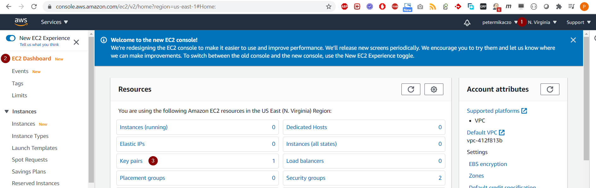
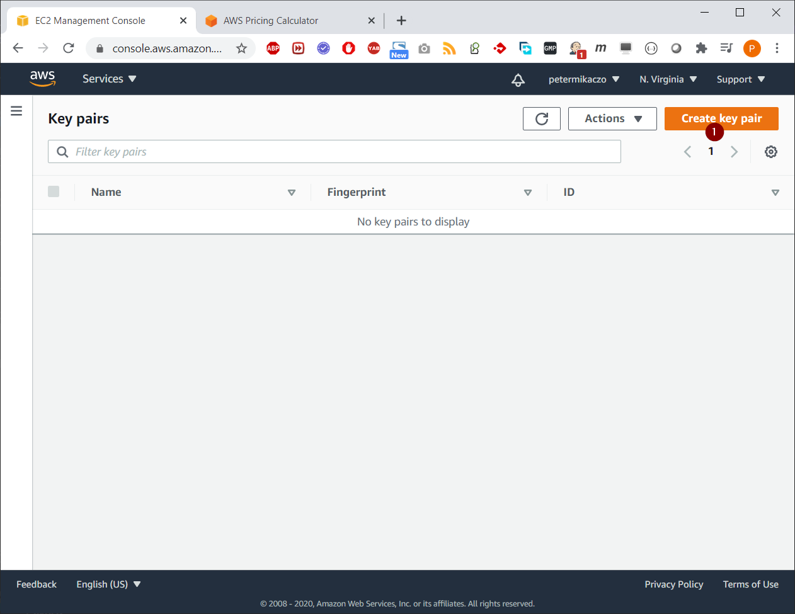
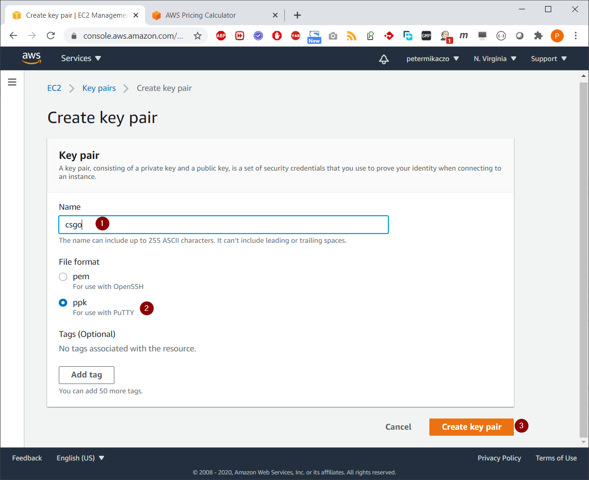
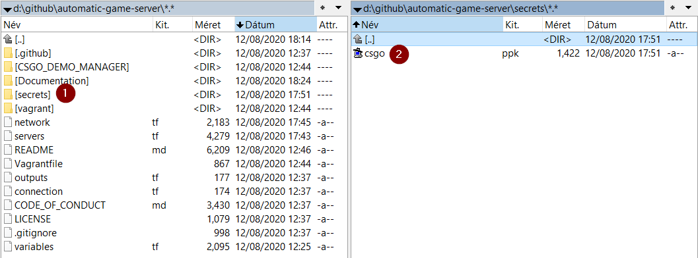
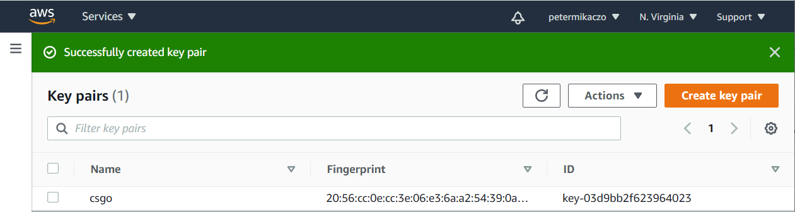
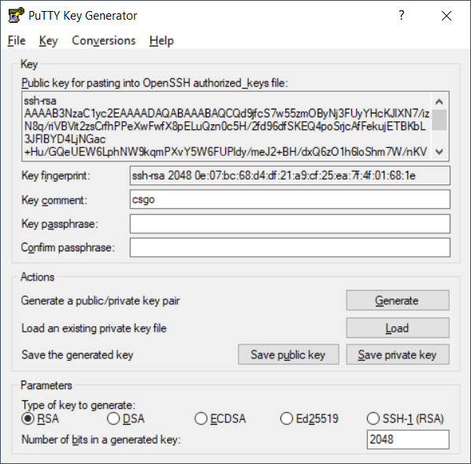
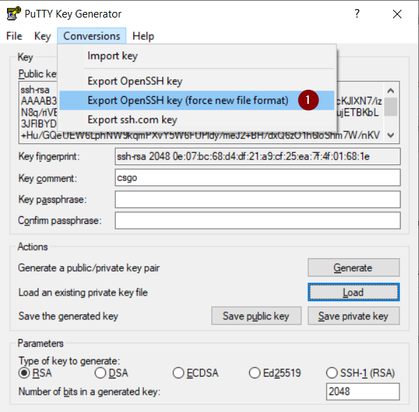
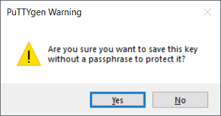
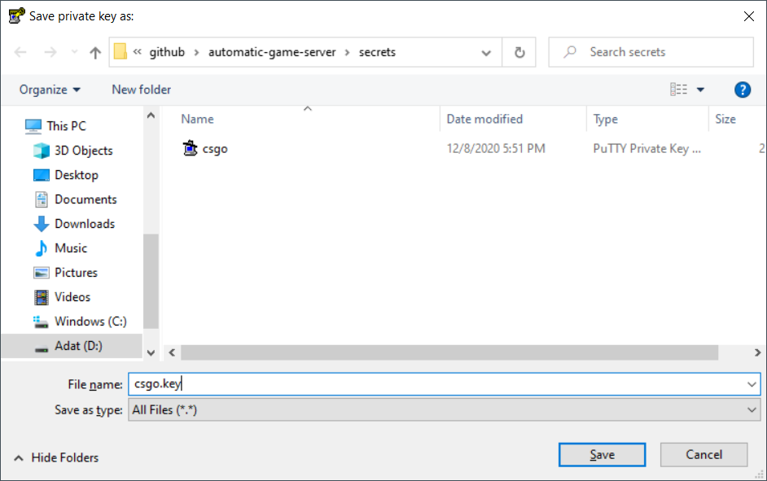

# Pre-requirement on AWS side - Create SSH key

Documentation about how you should create SSH-key in AWS, which is a pre-requirement to be able to apply terraform resources.

At the end you will got an SSH-key, which will have a public SSH-key in the affected AWS region, and the private pair of public in you local computer.

# Table of contents

- [Pre-requirement on AWS side - Create SSH key](#pre-requirement-on-aws-side---create-ssh-key)
- [Table of contents](#table-of-contents)
  - [AWS create SSH-key](#aws-create-ssh-key)
    - [AWS - SSH-keys](#aws---ssh-keys)
    - [Windows - SSH-keys](#windows---ssh-keys)
  - [License](#license)
  - [Author Information](#author-information)

## AWS create SSH-key

You must to have an **[AWS account](https://aws.amazon.com/free/) (has free tier - credit card required)**.  

### AWS - SSH-keys

In this section you will fin d how you can create an SSH-Key pair in AWS.

- Choose **destination region**, where you will deploy resources with terraform.
- Click to **EC2 Dashboard** to see resources inside it.
- Click to **Key pairs**.

- Click to **Create key pair**.

- Choose a **name**. Terraform will search for SSH-key by name.
- Click to **ppk** format. It has more compatibility.
- Click to **Create key pair**.
- At the end, **save** it to a place, which is **available for terraform** as well, like: 

- You should see similar at the end of the process in AWS.

### Windows - SSH-keys

In this section you will find, how you can covert the generated SSH-key (private) to be usable for terraform (SSH in).

- Open [PuTTYGen](https://www.puttygen.com/#Download_PuTTYgen_on_Windows) & load your previously generated SSH private key.

- **Export** The key in **"OpenSSH key (force new format)"** format.

- **Save the key without passphrase**. Code was not prepared to be able to handle SSH-key with password (if it is necessary, pageant should be used).

## License

MIT

## Author Information

Peter Mikaczo - <petermikaczo@gmail.com>
